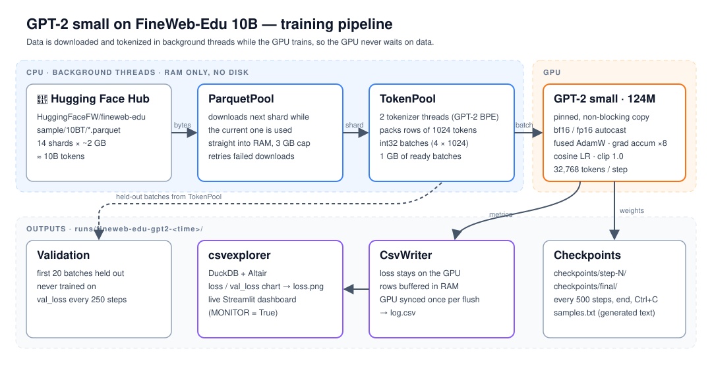

# GPT-2 Small on FineWeb-Edu 10B

Pre-train a **GPT-2 small (124M parameters)** from scratch on the
[FineWeb-Edu](https://huggingface.co/datasets/HuggingFaceFW/fineweb-edu) `sample/10BT`
split (~10 billion tokens of high-quality educational web text), with a data
pipeline and training loop tuned to keep the GPU busy and train as fast as possible
on a single GPU — from a free Colab T4 up to an A100.

## Why this project

Training a small language model is usually bottlenecked not by the model but by
everything around it: downloading tens of GB of data, tokenizing it, feeding the GPU,
and logging without stalling. This project focuses on making that whole path fast
and memory-efficient:

- **Streaming data straight into RAM** – parquet shards are downloaded in the
  background into memory (no disk round-trip), with a RAM cap so it fits Colab's 12.7 GB.
- **Parallel background tokenization** – worker threads tokenize the next shards
  while the GPU trains on the current batches, so the GPU never waits on data.
- **Mixed precision** – `bfloat16` autocast on Ampere+ GPUs (A100, L4, …),
  `float16` with a `GradScaler` on older GPUs (T4).
- **Fused AdamW** and weight decay on weight matrices only.
- **No per-step GPU sync** – the loss stays on the GPU; the CPU reads it only when
  printing or flushing logs, so the CPU keeps queueing work ahead of the GPU.
- **Pinned memory + non-blocking host→device copies.**
- **`torch.compile`** switch for extra speed on A100-class GPUs.
- **`expandable_segments`** CUDA allocator to reduce memory fragmentation.
- **Gradient accumulation** to reach large effective batch sizes on small GPUs.
- **Cosine LR schedule** with linear warmup, gradient clipping.

## Project layout

```
gpt2-small/
├── traingpt2.py          # the training run: config + training loop
├── requirements.txt
└── common/               # reusable building blocks
    ├── parquetpool.py    # downloads Hugging Face parquet shards into RAM, thread-safe
    ├── tokenpool.py      # tokenizes shards in background threads into ready batches
    ├── csvwriter.py      # low-overhead CSV logger (buffers rows, reads GPU once per flush)
    ├── csvexplorer.py    # DuckDB + Altair charts / live Streamlit dashboard for the logs
    └── test/             # tests for the modules
```

### Data pipeline



## Quick start

```bash
git clone https://github.com/ducbachsong/gpt2-small.git
cd gpt2-small
pip install -r requirements.txt
python traingpt2.py
```

On Google Colab:

```python
!git clone https://github.com/ducbachsong/gpt2-small.git
%cd gpt2-small
!pip install -r requirements.txt
!python traingpt2.py
```

A GPU and a network connection are required.

## Configuration

All settings are constants at the top of `traingpt2.py`:

| Setting | Default | Notes |
|---|---|---|
| `DATASET` / `ALLOW_PATTERNS` | `HuggingFaceFW/fineweb-edu` / `sample/10BT/*.parquet` | 14 shards, ~2 GB each |
| `SEQUENCE_LENGTH` | 1024 | context length |
| `BATCH_SIZE` | 4 | fits a 15 GB T4; use 8+ on an A100 |
| `GRAD_ACCUM_STEPS` | 8 | 4 × 1024 × 8 = 32,768 tokens per step |
| `N_LAYER` / `N_HEAD` / `N_EMBD` | 12 / 12 / 768 | GPT-2 small |
| `LEARNING_RATE` → `MIN_LEARNING_RATE` | 6e-4 → 6e-5 | cosine decay after `WARMUP_STEPS = 300` |
| `WEIGHT_DECAY` / `GRAD_CLIP` | 0.1 / 1.0 | |
| `MAX_STEPS` | 3000 | ~98M tokens; raise it to train on the full 10B |
| `COMPILE` | `False` | set `True` on A100-class GPUs |
| `MODEL_NAME` | `""` | `"gpt2"` fine-tunes OpenAI's weights instead of training from scratch |
| `PARQUET_RAM_LIMIT` / `TOKEN_RAM_LIMIT` | 3 GB / 1 GB | sized for Colab's 12.7 GB RAM |
| `MONITOR` | `False` | `True` opens a live loss dashboard (not on Colab) |

To use the full ~10B tokens: `MAX_STEPS ≈ 10e9 / TOKENS_PER_STEP` (≈ 305,000 steps at
32,768 tokens/step, or ≈ 19,000 steps at the GPT-2 paper's ~524k tokens/step).

## Outputs

Everything goes to `runs/fineweb-edu-gpt2-<time>/`:

- `log.csv` – step, tokens, loss, val_loss, lr, grad_norm, tokens/second
- `checkpoints/step-N/` and `checkpoints/final/` – Hugging Face `save_pretrained`
  format (load with `GPT2LMHeadModel.from_pretrained`), plus `training.json`
- `loss.png` – training and validation loss curve
- `samples.txt` – text generated by the final model from a few prompts

Training can be stopped at any time with **Ctrl+C**; the current model is evaluated
and saved.

## Using the trained model

```python
from transformers import AutoTokenizer, GPT2LMHeadModel

path = "runs/<run>/checkpoints/final"
tokenizer = AutoTokenizer.from_pretrained(path)
model = GPT2LMHeadModel.from_pretrained(path)
ids = tokenizer("Photosynthesis is the process", return_tensors="pt")
print(tokenizer.decode(model.generate(**ids, max_new_tokens=60, do_sample=True)[0]))
```

## Acknowledgements

- [FineWeb-Edu](https://huggingface.co/datasets/HuggingFaceFW/fineweb-edu) by Hugging Face
- GPT-2 by OpenAI; model implementation from 🤗 Transformers

## License

MIT
