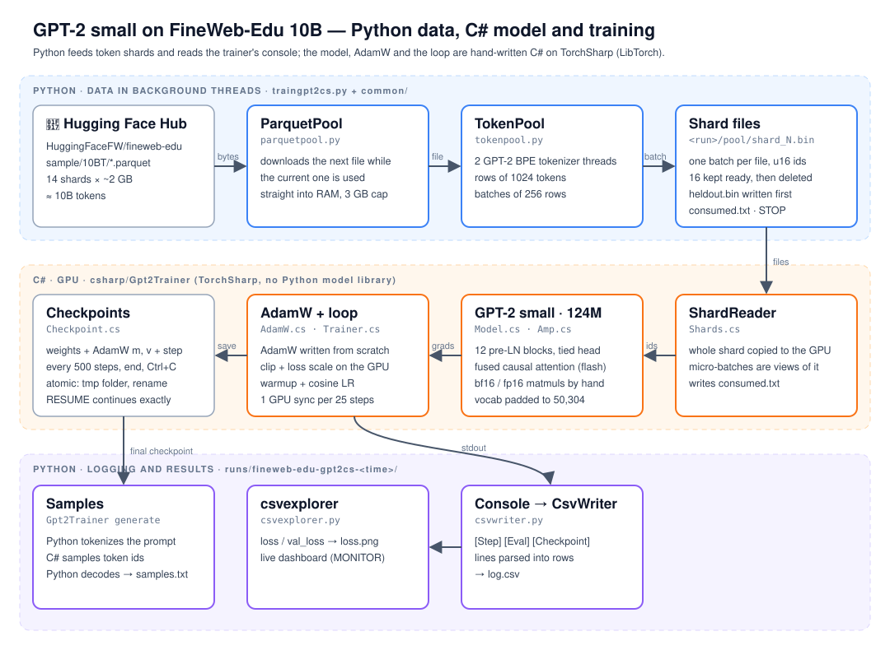

# GPT-2 Small on FineWeb-Edu 10B — C# trainer

Pre-train a **GPT-2 small (124M parameters)** from scratch on the
[FineWeb-Edu](https://huggingface.co/datasets/HuggingFaceFW/fineweb-edu) `sample/10BT`
split (~10 billion tokens of educational web text), as fast as a single GPU allows.

> **This is the `csharp-trainer` branch.** No Python model library is used:
> the GPT-2 model, the AdamW optimizer and the training loop are
> written by hand in **C#** on [TorchSharp](https://github.com/dotnet/TorchSharp)
> (the .NET bindings of LibTorch). The Python data pipeline, logging and charts
> from `main` are reused unchanged. The Hugging Face `transformers` version of the
> trainer is `traingpt2.py` on [`main`](https://github.com/ducbachsong/gpt2-small/tree/main).



## How the two sides work together

Python and C# run in **one process**. `traingpt2cs.py` uses
[pythonnet](https://github.com/pythonnet/pythonnet) to load the .NET runtime and the trainer dll
into Python. The C# training loop then takes each batch straight from `TokenPool`, the same way
`main`'s `traingpt2.py` does. No files or sockets sit in between.

| Direction | Channel | What |
|---|---|---|
| Python → C# | `Trainer.Start(args, …)` | the settings, as `--kebab-case value` pairs |
| C# → Python → C# | `NextBatch` callback | C# calls `next_batch()`, which runs `token_pool.get_token_batch()` and returns the int32 array's address (0 when the data runs out). C# copies it to the GPU. The first batch is held out for `val_loss` |
| C# → Python | `report` callback | `[Config]`, `[Step]`, `[Eval]`, `[Done]` lines, parsed into `log.csv` |
| Python → C# → Python | `--prompts` / `[Sample]` | prompts go in as token ids; generated ids come back and Python decodes them |
| Python → C# | `Trainer.RequestStop()` | Ctrl+C: the trainer finishes its step, evaluates and samples |

The trainer runs on its **own .NET thread**. A .NET call made from Python holds Python's lock
(the GIL) until it returns, so a trainer running on Python's thread would stop the tokenizer
threads. The trainer's thread takes the GIL only inside the two callbacks.

TorchSharp brings its own LibTorch, so **PyTorch must not load into the same process**.
`traingpt2cs.py` blocks `import torch`, and `transformers` then loads only its tokenizers.

## What makes it fast

**Data (Python, from `main`)**
- Parquet files are downloaded **straight into RAM** in the background, with a RAM cap.
- **Tokenizer threads** fill a buffer of ready batches while the GPU trains.
- Each **batch is copied to the GPU whole**, straight from the numpy array's memory.
  Micro-batches are views of it, so Python is asked once per 256 rows.

**Model and training (C#)**
- **Fused causal attention** (`scaled_dot_product_attention`), which never builds the T×T matrix.
- **Pure fp32** everywhere, like lab06: no mixed precision and no TF32.
- **Few CPU↔GPU syncs**: the loss and grad norm of each step go into GPU buffers that are read
  once every `PRINT_EVERY` steps. Gradient clipping is written to stay on the GPU
  (TorchSharp's `clip_grad_norm_` returns a `double`, which would sync every step).
- **Vocabulary padded to 50,304** (a multiple of 64) for faster matmuls. Padding ids are never sampled.
- **Loss on T−1 positions only**: the last hidden state is dropped *before* the 50k-wide head matmul.
- AdamW with decoupled weight decay on matrices only, β = (0.9, 0.95), linear warmup + cosine LR,
  gradient clipping at 1.0, and GPT-2's scaled init for residual projections.
- **Flat buffers, owned by the model**: when `Gpt2` is built, every parameter and every gradient
  becomes a view into one flat buffer (`FlatParameters.cs`). The layers use their own tensors as
  usual; AdamW works on the two big buffers, so a step is 11 tensor operations over the whole
  model, with no per-parameter loop, and matches `torch.optim.AdamW` bit for bit.

## Project layout

```
gpt2-small/
├── traingpt2cs.py            # the run: settings, loads the C# trainer in-process, logs
├── Gpt2Trainer.csproj        # the C# trainer project: builds src/*.cs into a library
├── Gpt2Trainer.sln           # the trainer + the tests, for dotnet test and the IDE
├── nuget.config              # where NuGet gets TorchSharp and LibTorch (nuget.org)
├── src/                      # the code: C# model and training, Python data pipeline
│   ├── Model.cs              # GPT-2: attention, MLP, blocks, tied head, sampling
│   ├── FlatParameters.cs     # the model's parameters and gradients in two flat buffers
│   ├── AdamW.cs              # AdamW over those buffers, LR schedule, clipping
│   ├── Trainer.cs            # what Python calls: training loop on its own thread, eval, samples
│   ├── TokenFeed.cs          # batches from Python's next_batch() onto the GPU
│   ├── Config.cs             # every setting, overridable as --kebab-case flags
│   ├── test/                 # xUnit tests for the trainer
│   │   ├── AdamWTests.cs     # AdamW vs torch.optim.AdamW
│   │   ├── TokenFeedTests.cs # the feed reads the exact ids it is handed
│   │   └── adamw-benchmark-torch.py  # Python PyTorch's AdamW timed, to compare
│   └── common/               # Python: data, logging, charts (unchanged from main)
│       ├── parquetpool.py    # parquet files from the HF Hub into RAM, thread-safe
│       ├── tokenpool.py      # background tokenization into ready batches
│       ├── csvwriter.py      # low-overhead CSV logger
│       ├── csvexplorer.py    # DuckDB + Altair charts / live dashboard
│       └── test/             # a test script per module
└── docs/                     # diagrams
```

## Quick start

### Google Colab (GPU)

```python
!git clone -b csharp-trainer https://github.com/ducbachsong/gpt2-small.git
%cd gpt2-small
!pip install -q -r requirements.txt
!python traingpt2cs.py
```

Colab has no .NET, so the first run installs the .NET 8 SDK into `~/.dotnet`. It then builds
the C# project, and NuGet downloads LibTorch 2.10 with CUDA 12.8 (~2 GB).

### Locally

Requirements: Python 3.10+, the [.NET 8 SDK](https://dotnet.microsoft.com/download) (installed
into `~/.dotnet` by `traingpt2cs.py` if missing), and an
NVIDIA GPU (the CPU works for testing only).

```bash
git clone -b csharp-trainer https://github.com/ducbachsong/gpt2-small.git
cd gpt2-small
pip install -r requirements.txt
python traingpt2cs.py
```

`traingpt2cs.py` detects the GPU with `nvidia-smi` and then picks the LibTorch build
(`cpu`, `cuda-linux` or `cuda-windows`) and the micro-batch size, based on GPU memory.

### Building the C# trainer by itself

```bash
dotnet build Gpt2Trainer.csproj -c Release -p:TorchBackend=cuda-linux -r linux-x64 --no-self-contained   # or cpu / cuda-windows, win-x64
```

The trainer is a library that `traingpt2cs.py` loads. It has no data source of its own, so it
does not run alone. Every property in `Config.cs` is a `--kebab-case` setting.

### Comparing with the transformers trainer

`traingpt2.py` on `main` trains the same run with Hugging Face's `GPT2LMHeadModel` and
PyTorch's AdamW on the same data pipeline. Its defaults match `traingpt2cs.py` (3000 steps of
32,768 tokens), so you can compare the loss curves and tokens/second on the same GPU.

## Tests

```bash
dotnet test Gpt2Trainer.sln   # the C# tests, on the CPU build of LibTorch

python src/common/test/tokenpool-test.py   # each Python module has a test script
```

`src/test/AdamWTests.cs` checks the hand-written AdamW against TorchSharp's built-in
`torch.optim.AdamW` (PyTorch's own): a copy of each parameter is trained with it on the same
gradients, and ours must match it bit for bit. It also covers weight
decay (matrices only), gradient clipping, the learning-rate schedule, and the flat buffers
(every parameter and gradient is a view into one tensor; backward through the model writes into it).

`BenchmarkOursAgainstTheBuiltInAdamW` times one optimiser step, ours against TorchSharp's built-in
`torch.optim.AdamW`, on GPT-2's 148 parameter tensors (narrowed to ~9M values). It prints the
timings rather than failing on them. `src/test/adamw-benchmark-torch.py` times Python PyTorch's
AdamW on the same shapes in its three modes. On a Colab Tesla T4:

| AdamW | ms per step |
|---|---|
| PyTorch `fused=True` (Python) | 1.95 |
| **ours** (C#, flat buffers) | **3.64** |
| PyTorch `foreach=True` (Python) | 4.09 |
| PyTorch for-loop (Python) | 15.47 |
| TorchSharp built-in (C#) | 15.75 |

The flat buffers remove the per-parameter loop: ours is 4.3x faster than TorchSharp's AdamW, which
is the one C# can use, and a little faster than PyTorch's `foreach`. PyTorch's fused kernel is still
1.9x faster: a step here is limited by memory traffic, and one kernel reads and writes each buffer
once, where ours runs about 10 separate operations over whole buffers. TorchSharp does not expose
that kernel.

```bash
dotnet test Gpt2Trainer.sln --filter Category=AdamW-Benchmark --logger "console;verbosity=detailed"
dotnet test Gpt2Trainer.sln --filter Category!=AdamW-Benchmark   # everything else
```

## Configuration

All settings are at the top of `traingpt2cs.py`, which passes them to the C# trainer:

| Setting | Default | Notes |
|---|---|---|
| `DATASET` / `ALLOW_PATTERNS` | `HuggingFaceFW/fineweb-edu` / `sample/10BT/*.parquet` | 14 files, ~2 GB each |
| `SEQUENCE_LENGTH` | 1024 | context length |
| `BATCH_ROWS` | 256 | rows per TokenPool batch, copied to the GPU in one go |
| `N_LAYER` / `N_HEAD` / `N_EMBD` | 12 / 12 / 768 | GPT-2 small |
| `TOKENS_PER_STEP` | 32,768 | micro-batch × 1024 × gradient accumulation |
| `MICRO_BATCH` | `None` = auto | 4 on 16 GB (T4), 8 on 40 GB (A100), 16 on 80 GB |
| `LEARNING_RATE` → `MIN_LEARNING_RATE` | 6e-4 → 6e-5 | cosine after `WARMUP_STEPS = 300` |
| `WEIGHT_DECAY` / `GRAD_CLIP` | 0.1 / 1.0 | |
| `MAX_STEPS` | 3000 | ~98M tokens; ~305,000 steps for the full 10B |
| `PRINT_EVERY` | 25 | also how often the trainer waits for the GPU |
| `PROMPTS` | 3 prompts | continued by the model at the end, into `samples.txt` |
| `MONITOR` | `False` | `True` opens a live loss dashboard (not on Colab) |

## Outputs

Everything goes to `runs/fineweb-edu-gpt2cs-<time>/`:

- `log.csv`: step, tokens, loss, val_loss, lr, grad_norm, tokens/second
- `loss.png`: the training and validation loss curves
- `samples.txt`: the trained model's continuation of each prompt

The model is not saved: when training ends, the trainer evaluates, writes the samples, and exits.
Press **Ctrl+C** to end early. The trainer finishes its step, evaluates and writes the samples.

## Acknowledgements

- [FineWeb-Edu](https://huggingface.co/datasets/HuggingFaceFW/fineweb-edu) by Hugging Face
- GPT-2 by OpenAI
- [TorchSharp](https://github.com/dotnet/TorchSharp) by the .NET Foundation

## License

MIT
